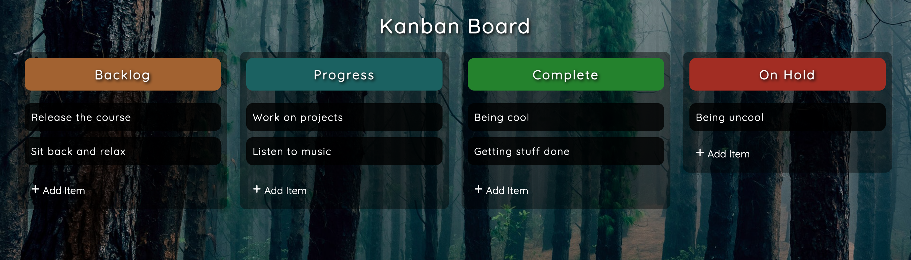

# Drag & Drop

Exercise Project of `ZTM` Cours on Udemy ([JavaScript Web Projects: 20 Projects to Build Your Portfolio](https://www.udemy.com/course/javascript-web-projects-to-build-your-portfolio-resume)).

## Description

Programmed in vanilla-js.

## Useful references

- [CSS Tricks - Custom Scrollbars](https://css-tricks.com/the-current-state-of-styling-scrollbars-in-css/)
- [W3Schools - Drag and Drop](https://www.w3schools.com/html/html5_draganddrop.asp)
- [W3Schools - ondragenter Attribute](https://www.w3schools.com/tags/att_ondragenter.asp)
- [Mozilla- Array.Push](https://developer.mozilla.org/en-US/docs/Web/JavaScript/Reference/Global_Objects/Array/push)
- [Mozilla contenteditable](https://developer.mozilla.org/en-US/docs/Web/HTML/Global_attributes/contenteditable)
- [Mozilla - focusout event](https://developer.mozilla.org/en-US/docs/Web/API/Element/focusout_event)
- [Mozilla - Array.Filter](https://developer.mozilla.org/en-US/docs/Web/JavaScript/Reference/Global_Objects/Array/filter)